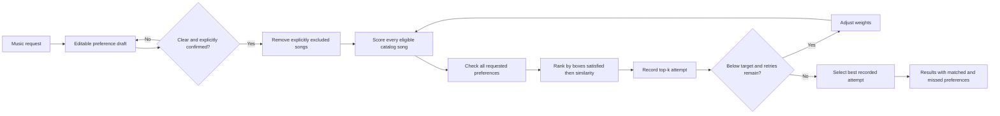

# GrooveMatch

**Content-based music recommendations with intent validation and match-quality reporting and fallback handling.**

GrooveMatch turns a natural-language music request into a ranked playlist, then evaluates the results through a separate validation layer. The core design distinguishes **similarity scoring** from **intent compliance**: a song can rank highly overall while missing a specific request, such as low-energy music.

Built in Python, the system combines explainable feature scoring, a bounded retry pipeline, best-attempt tracking, and diagnostic output. It demonstrates a practical approach to recommendation reliability: make decisions inspectable, surface unmet constraints, and return alternatives when the target cannot be reached.

## Engineering highlights

- **Separation of concerns:** Independent scoring, validation, weight suggestion, and orchestration modules make each stage easier to inspect and test.
- **Explainable recommendations:** Each result includes a score and feature-level contributions for genre, mood, energy, acousticness, and valence.
- **Reliability pipeline:** Recommendation sets below the validation target trigger bounded re-scoring attempts; low-match-rate results use the best recorded attempt with diagnostic context.
- **Traceable decisions:** Structured results include validation feedback, proposed weight changes, iteration history, and a readable decision log.
- **Local execution:** The CLI and recommendation pipeline use the Python standard library, a bundled CSV catalog, and no external API credentials.

**Preference-first ranking:** After confirmation, every eligible catalog song is checked against the explicitly requested genre, mood, energy, and acoustic preference before selecting results. Complete matches come first; partial matches are ordered by boxes satisfied, then similarity. Retry history preserves earlier results so later rounds cannot replace them with a lower-quality selection.

## Quick start

Run these commands from the repository root with Python 3.10 or newer:

```bash
python -m venv .venv
source .venv/bin/activate
pip install -r requirements.txt
python -m src.main
```

On Windows, use `.venv\Scripts\activate` to activate the environment.

The CLI loads the 100-song catalog and walks through six example profiles. Each request opens a preference review before any scoring. Confirm with `c`, or use the numbered editors to change individual fields. Press Enter between profiles, then enter `y` to try your own requests. Type `quit` at the request prompt to exit.

Example requests:

```text
I want lofi music that is chill and relaxing, I like acoustic sounds
I want happy music but I am tired and exhausted
I want upbeat energetic pop music for my workout
```

The repository includes pandas and Streamlit in its dependency list, but the current application is a command-line program.

### Review and revise preferences

Every request requires confirmation, including clear requests. The review displays:

1. **Genre:** allowed alternatives and explicit exclusions.
2. **Mood:** allowed alternatives and explicit exclusions; related moods count as matches.
3. **Energy:** any, sleepy, low, medium, high, or a custom 0–1 range.
4. **Acousticness:** any, prefer acoustic/non-acoustic, or exclude either style.
5. **Clarification:** unresolved wording and the option to explicitly omit unsupported parts.

Choose a field number to edit only that field. Genre and mood editors use numbered, comma-separated selections; multiple allowed values mean **OR**. Enter preserves existing selections. After each edit, the complete draft is shown again. Type `c` to confirm or `x` to cancel. Empty input never confirms.

For example, “high energy but low energy” stays in review until the energy field is changed. “Pop or jazz” accepts either genre; “no metal” excludes metal. “Music like Beyoncé” flags unsupported artist similarity. The user can express the desired style through the editors and explicitly omit the unsupported reference. The application never asks the user to guess a replacement English sentence.

Explicit exclusions are never relaxed to fill the requested count. A playlist may therefore contain fewer than `k` songs. Positive preferences retain the complete-first, partial-match fallback policy.

### Python API

```python
from src.recommender import load_songs
from src.reliability_engine import ReliabilityEngine
from src.preference_ui import review_preferences

engine = ReliabilityEngine(load_songs("data/songs.csv"))
draft = engine.prepare_request("I want happy music but I am tired")
confirmed = review_preferences(draft)  # Prompts for edits and explicit confirmation.
if confirmed is not None:
    result = engine.process_user_request(
        draft.request, confirmed_preferences=confirmed, k=5,
    )
    print(engine.log_result(result))
```

**API change:** Calling `process_user_request()` without `confirmed_preferences` raises `PreferenceReviewRequired`, whose `draft` can be displayed and edited. For another UI, render `draft.summary()`, apply explicit edits with `set_choices()`, `set_energy()`, or `set_acoustic()`, and call `draft.confirm()` only after the user confirms. It refuses unresolved drafts. Pass any base profile to `prepare_request()`.

Confirmation creates an immutable snapshot. Scoring, validation, retry weights, and diagnostics use that snapshot rather than reparsing the original sentence. Later draft edits do not alter an earlier snapshot; a confirmation from another request is rejected.

`PlaylistResult` exposes recommendations, per-song matched/missed preferences, complete-match rate, preference coverage, retry metadata, and a decision log. `attempt_history` retains each round’s recommendations, weights, validation, and comparison quality; `selected_iteration` identifies the returned round (zero is the initial round).

## How the pipeline works



The retry node passes adjusted weights into the scorer while retaining the confirmed profile and constraints. See the [architecture notes](diagrams/system_diagram.md) for component responsibilities and control flow.

### Similarity scoring

Songs receive a weighted sum of five feature scores. The initial weights are:

| Feature | Weight | Matching rule |
| --- | ---: | --- |
| Genre | 40% | Exact genre match |
| Mood | 30% | Exact match or partial credit through predefined mood groups |
| Energy | 15% | Distance from the user's target energy |
| Acousticness | 10% | Alignment with acoustic or non-acoustic preference |
| Valence | 5% | Brightness preference inferred from the selected mood |

The standalone scorer ranks by similarity. The reliability engine checks the entire scored catalog after explicit exclusions, then ranks by requested preferences satisfied, using similarity only to break ties. Parser defaults can affect that tie-break but do not become validation requirements.

### Validation and fallback

Each explicitly requested category counts as one equal-weight box. Repeated synonyms do not add weight. Genre must match an allowed alternative if any were selected; mood can match an allowed alternative exactly or through the existing related-mood groups. Excluded values are filtered out before scoring. Energy must meet all requested bounds. Acoustic preference uses the existing acousticness threshold of 0.60. For example, “acoustic jazz” checks jazz genre and acousticness, without requiring the genre label “acoustic.”

The complete-match rate (`validation.match_rate` and `final_match_rate`) is the fraction of returned songs satisfying **all** recognized requested categories. The API temporarily retains `confidence` as a compatibility alias for this rate; user-facing output does not call it confidence. `preference_coverage` measures the fraction of boxes satisfied across those songs. A playlist can have no complete matches while still satisfying most preferences. Neither measure is a calibrated probability of satisfaction. Requests with no recognized preferences are **not evaluated**: match rate, preference coverage, and the compatibility `confidence` field are `None`, and `validation.evaluated` is false. Only after the user explicitly accepts having no preferences and confirms, the system returns labeled unvalidated suggestions based on the default or supplied profile and skips validation retries. This differs from an evaluated request whose songs satisfy no preferences, which has a genuine 0% rate.

Every round retains the full top-k result, weights, validation details, and match quality. Final selection compares complete-match count, then total boxes satisfied, then similarity under the unchanged default weights so comparisons use a common scale. Exact ties retain the earlier round. The final result always uses the best recorded attempt, even above the diagnostic threshold. Each round uses its applied weights for within-round similarity tie-breaking and score explanations.

Checking the entire catalog already maximizes complete matches and box counts for the available songs. Retries can change similarity tie-breaks; they cannot create missing complete matches or override the preference ordering. Diagnostics count matches with the same checks used for ranking and validation. Both CLI modes expose per-song compromises.

Default controls are configurable through `process_user_request()`:

| Parameter | Default | Behavior |
| --- | ---: | --- |
| `k` | 5 | Maximum number of recommendations |
| `min_match_rate` | 0.70 | Trigger retries below this match rate |
| `max_iterations` | 3 | Bound the number of retry attempts |
| `min_acceptable_confidence` | 0.40 | Legacy parameter name: attach diagnostics below this complete-match rate |

Diagnostic messages distinguish an empty catalog, no complete matches, and too few complete matches to fill the requested count. They report how many results were actually returned and separate complete matches, partial matches, and alternatives satisfying none of the requested preferences. Both CLI modes show these messages when the configured threshold triggers them. Scarce matches are not described as proof of conflicting preferences.

A result at exactly 40% does not trigger low-match-rate diagnostics. Best-attempt selection applies at every evaluated match rate. Results below the target can still be returned as partial matches after retries are exhausted.

## Reproducible examples

These results were checked against the bundled 100-song catalog after confirming the interpreted fields, with the default parameters:

| Request | Complete-match rate | Preference coverage | Retries | Selected round |
| --- | ---: | ---: | ---: | ---: |
| “I want lofi music that is chill and relaxing, I like acoustic sounds” | 0% | 75.0% | 3 | 0 |
| “I want happy music but I am tired and exhausted” | 80% | 90.0% | 0 | 0 |
| “I want upbeat energetic pop music for my workout” | 60% | 86.7% | 3 | 0 |
| “I want sleepy music” | 100% | 100.0% | 0 | 0 |

The lofi request has no complete matches because the catalog has no lofi-tagged tracks. Its top three partial matches are **A Drop in the Ocean** (0.549), **I Won't Give Up** (0.548), and **Collide - Acoustic Version** (0.546). Each satisfies mood, energy, and acousticness while missing genre: 75% preference coverage and 0% complete-match rate. The source's `study` category remains distinct from lofi.

These examples demonstrate control flow and current behavior; they are not a benchmark of listener satisfaction or evidence of improvement from retrying.

## Testing

```bash
python -m pytest tests/ -v
```

The repository contains 83 test functions covering score ordering, keyword extraction, preference parsing, validation feedback, conflict detection, weight normalization, retry limits, and orchestration outputs. The tests are organized by component to make regressions easier to localize.

Regression tests cover every validation category, related moods, synonym consolidation, complete matches outside the similarity top-k, partial-match ordering, default-profile exclusion, retry weight application, and preservation of earlier results even above the diagnostic threshold. They also check empty catalogs, consistent diagnostics, unevaluated requests, and both CLI modes. Review tests verify confirmation before scoring, explicit exclusions, OR alternatives, clarification of contradictions/unsupported wording, persistent field edits, immutable snapshots, and cancellation without scoring.

## Project structure

```text
src/
  main.py                 CLI walkthrough and interactive requests
  preferences.py          Phrase parsing, editable drafts, and confirmed snapshots
  preference_ui.py        Numbered field editors and confirmation prompts
  recommender.py          Data models, CSV loading, and similarity scoring
  validator.py            Intent extraction and recommendation checks
  optimizer.py            Weight suggestions and iteration helpers
  reliability_engine.py   Pipeline orchestration, fallback, and diagnostics
data/songs.csv            Bundled 100-song catalog
data/song_sources.csv     Per-recording source identifiers
data/README.md            Provenance and approximate mood-label policy
tests/                    Component and pipeline tests
diagrams/system_diagram.md
model_card.md             Evaluation scope, data assumptions, and limitations
```

After the user explicitly accepts unvalidated suggestions and confirms, a request such as “surprise me” displays **“Not evaluated—no supported preferences recognized”** and **“Unvalidated suggestions based on the default or supplied profile.”** A partial match instead displays both metrics, for example **“Complete-match rate: 0.0% (0 of 5 songs match all recognized preferences)”** and **“Preference coverage: 75.0%.”** Similarity scores are labeled separately.

The [catalog notes](data/README.md) document the source, selection policy, approximate moods, and test impact. Numeric audio features are preserved from the source dataset.

## Evaluation and next steps

The [model card](model_card.md) documents the scoring rules, metric semantics, catalog constraints, and evaluation gaps. The main priorities are:

1. Evaluate retry behavior across a broader range of requests and catalog distributions.
2. Evaluate whether users need explicit priority controls beyond the current equal-category policy.
3. Expand supported phrasing while preserving clarification and explicit confirmation for uncertain interpretations.
4. Evaluate relevance and catalog coverage on a larger, documented dataset with human feedback.

Development included assistance from Claude. The implementation and reproducible examples are the basis for the capabilities described here.
