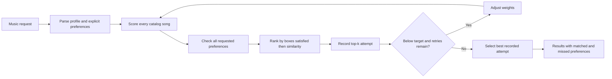

# GrooveMatch

**Content-based music recommendations with intent validation and confidence-based fallback handling.**

GrooveMatch turns a natural-language music request into a ranked playlist, then evaluates the results through a separate validation layer. The core design distinguishes **similarity scoring** from **intent compliance**: a song can rank highly overall while missing a specific request, such as low-energy music.

Built in Python, the system combines explainable feature scoring, a bounded retry pipeline, best-attempt tracking, and diagnostic output. It demonstrates a practical approach to recommendation reliability: make decisions inspectable, surface unmet constraints, and return alternatives when the target cannot be reached.

## Engineering highlights

- **Separation of concerns:** Independent scoring, validation, weight suggestion, and orchestration modules make each stage easier to inspect and test.
- **Explainable recommendations:** Each result includes a score and feature-level contributions for genre, mood, energy, acousticness, and valence.
- **Reliability pipeline:** Recommendation sets below the validation target trigger bounded re-scoring attempts; low-confidence results use the best recorded attempt with diagnostic context.
- **Traceable decisions:** Structured results include validation feedback, proposed weight changes, iteration history, and a readable decision log.
- **Local execution:** The CLI and recommendation pipeline use the Python standard library, a bundled CSV catalog, and no external API credentials.

**Preference-first ranking:** Every catalog song is checked against the explicitly requested genre, mood, energy, and acoustic preference before selecting results. Complete matches come first; partial matches are ordered by boxes satisfied, then similarity. Retry history preserves earlier results so later rounds cannot replace them with a lower-quality selection.

## Quick start

Run these commands from the repository root with Python 3.10 or newer:

```bash
python -m venv .venv
source .venv/bin/activate
pip install -r requirements.txt
python -m src.main
```

On Windows, use `.venv\Scripts\activate` to activate the environment.

The CLI loads the 100-song catalog and walks through six example profiles. Press Enter between profiles, then enter `y` to try your own requests. Type `quit` to exit.

Example requests:

```text
I want lofi music that is chill and relaxing, I like acoustic sounds
I want happy music but I am tired and exhausted
I want upbeat energetic pop music for my workout
```

The repository includes pandas and Streamlit in its dependency list, but the current application is a command-line program.

### Python API

```python
from src.recommender import load_songs
from src.reliability_engine import ReliabilityEngine

engine = ReliabilityEngine(load_songs("data/songs.csv"))
result = engine.process_user_request(
    "I want happy music but I am tired and exhausted",
    k=5,
)

print(engine.log_result(result))
for song, score, reasons in result.recommendations:
    print(f"{song.title} — {song.artist}: {score:.3f}")
```

`PlaylistResult` exposes recommendations, per-song matched/missed preferences, complete-match rate, preference coverage, retry metadata, and a decision log. `attempt_history` retains each round’s recommendations, weights, validation, and comparison quality; `selected_iteration` identifies the returned round (zero is the initial round).

## How the pipeline works



The retry node passes adjusted weights into the scorer while retaining the parsed user profile. See the [architecture notes](diagrams/system_diagram.md) for component responsibilities and control flow.

### Similarity scoring

Songs receive a weighted sum of five feature scores. The initial weights are:

| Feature | Weight | Matching rule |
| --- | ---: | --- |
| Genre | 40% | Exact genre match |
| Mood | 30% | Exact match or partial credit through predefined mood groups |
| Energy | 15% | Distance from the user's target energy |
| Acousticness | 10% | Alignment with acoustic or non-acoustic preference |
| Valence | 5% | Brightness preference inferred from the selected mood |

The standalone scorer ranks by similarity. The reliability engine checks the entire scored catalog, then ranks by requested preferences satisfied, using similarity only to break ties. Parser defaults can affect that tie-break but do not become validation requirements.

### Validation and fallback

Each explicitly requested category counts as one equal-weight box. Repeated synonyms do not add weight. Genre must match its recognized label; mood can be exact or related through the existing mood groups. Energy must meet all requested bounds. Acoustic preference uses the existing acousticness threshold of 0.60. For example, “acoustic jazz” checks jazz genre and acousticness, without requiring the genre label “acoustic.”

The field named `confidence` is the fraction of returned songs satisfying **all** recognized requested categories. `preference_coverage` measures the fraction of boxes satisfied across those songs. A playlist can have no complete matches while still satisfying most preferences. Neither measure is a calibrated probability of satisfaction. Requests with no recognized preferences retain the prior nonempty-result match-rate convention of 100%, accompanied by an explicit “no recognized preferences” explanation.

Every round retains the full top-k result, weights, validation details, and match quality. Final selection compares complete-match count, then total boxes satisfied, then similarity under the unchanged default weights so comparisons use a common scale. Exact ties retain the earlier round. The final result always uses the best recorded attempt, even above the low-confidence threshold. Each round uses its applied weights for within-round similarity tie-breaking and score explanations.

Checking the entire catalog already maximizes complete matches and box counts for the available songs. Retries can change similarity tie-breaks; they cannot create missing complete matches or override the preference ordering. Diagnostics count matches with the same checks used for ranking and validation. Both CLI modes expose per-song compromises.

Default controls are configurable through `process_user_request()`:

| Parameter | Default | Behavior |
| --- | ---: | --- |
| `k` | 5 | Maximum number of recommendations |
| `min_match_rate` | 0.70 | Trigger retries below this match rate |
| `max_iterations` | 3 | Bound the number of retry attempts |
| `min_acceptable_confidence` | 0.40 | Attach low-confidence diagnostics below this rate |

A result at exactly 40% does not trigger low-confidence diagnostics. Best-attempt selection applies at every confidence level. Results below the target can still be returned as partial matches after retries are exhausted.

## Reproducible examples

These results were checked against the bundled 100-song catalog with the default parameters:

| Request | Complete-match rate | Preference coverage | Retries | Selected round |
| --- | ---: | ---: | ---: | ---: |
| “I want lofi music that is chill and relaxing, I like acoustic sounds” | 0% | 75.0% | 3 | 0 |
| “I want happy music but I am tired and exhausted” | 80% | 90.0% | 0 | 0 |
| “I want upbeat energetic pop music for my workout” | 60% | 86.7% | 3 | 0 |
| “I want sleepy music” | 100% | 100.0% | 0 | 0 |

The lofi request has no complete matches because the catalog has no lofi-tagged tracks. Its top three partial matches are **A Drop in the Ocean** (0.549), **I Won't Give Up** (0.548), and **Collide - Acoustic Version** (0.546). Each satisfies mood, energy, and acousticness while missing genre: 75% preference coverage and 0% complete-match rate. The source's `study` category remains distinct from lofi.

These examples demonstrate control flow and current behavior; they are not a benchmark of listener satisfaction or evidence of improvement from retrying.

## Testing

```bash
python -m pytest tests/ -v
```

The repository contains 47 test functions covering score ordering, keyword extraction, preference parsing, validation feedback, conflict detection, weight normalization, retry limits, and orchestration outputs. The tests are organized by component to make regressions easier to localize.

Regression tests cover every validation category, related moods, synonym consolidation, complete matches outside the similarity top-k, partial-match ordering, default-profile exclusion, retry weight application, and preservation of earlier results even above the diagnostic threshold. They also check empty catalogs and consistent diagnostic counts.

## Project structure

```text
src/
  main.py                 CLI walkthrough and interactive requests
  recommender.py          Data models, CSV loading, and similarity scoring
  validator.py            Intent extraction and recommendation checks
  optimizer.py            Weight suggestions and iteration helpers
  reliability_engine.py   Pipeline orchestration, fallback, and diagnostics
data/songs.csv            Bundled 100-song catalog
data/song_sources.csv     Per-recording source identifiers
data/README.md            Provenance and approximate mood-label policy
tests/                    Component and pipeline tests
diagrams/system_diagram.md
model_card.md             Evaluation scope, data assumptions, and limitations
```

The [catalog notes](data/README.md) document the source, selection policy, approximate moods, and test impact. Numeric audio features are preserved from the source dataset.

## Evaluation and next steps

The [model card](model_card.md) documents the scoring rules, metric semantics, catalog constraints, and evaluation gaps. The main priorities are:

1. Evaluate retry behavior across a broader range of requests and catalog distributions.
2. Evaluate whether users need explicit priority controls beyond the current equal-category policy.
3. Improve parsing for negation, ambiguous requests, and unsupported vocabulary.
4. Evaluate relevance and catalog coverage on a larger, documented dataset with human feedback.

Development included assistance from Claude. The implementation and reproducible examples are the basis for the capabilities described here.
