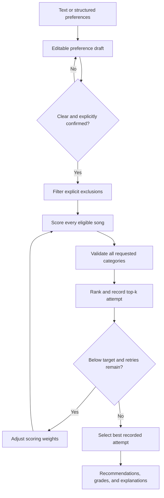

# GrooveMatch

**Explainable music recommendations with preference validation and transparent fallback results.**

GrooveMatch is a Python and Streamlit application that recommends songs from a curated catalog of 100 real recordings. Describe what you want to hear or select preferences with dropdowns and an energy range slider, then review your choices and explore recommendations with clear match grades and explanations.

The core design separates **similarity scoring** from **intent validation**. A song can sound like a good overall fit while missing a specific preference. GrooveMatch checks each requested category, prioritizes complete matches, and explains the compromises when the catalog cannot satisfy the request.

## Engineering highlights

- **User-controlled input:** Editable preferences, explicit clarification, and confirmation before scoring. Text and structured inputs use the same recommendation pipeline.
- **Separation of concerns:** Independent parsing, scoring, validation, optimization, and orchestration modules support both the web interface and CLI.
- **Reliable fallback handling:** Bounded re-scoring, retained attempt history, and consistent comparison of earlier results. Explicit exclusions are never relaxed.
- **Explainability:** Per-song matched and missed preferences, feature-level score contributions, playlist metrics, and retry history.
- **Defensive data ingestion:** Invalid numeric features reject the catalog with actionable row-level errors rather than silently altering data.
- **Regression coverage:** 186 pytest cases, including Streamlit interaction tests, boundary conditions, cancellation, exclusions, and state isolation.

Built with assistance from Claude Code. The recommendation engine is deterministic and rule-based; using the app requires no LLM or music-service API credentials.

## Run locally

From the repository root, with Python 3.10 or newer:

```bash
python -m venv .venv
source .venv/bin/activate
python -m pip install -r requirements.txt
python -m streamlit run app.py
```

On Windows, activate the environment with `.venv\Scripts\activate`. Open the local URL printed by Streamlit.

## Walkthrough

1. **Explore an example, optionally.** Expand **See how it works · optional demo**, choose a profile, and click **Load this example**. Loading a demo does not score songs until you confirm its preferences.
2. **Choose your input method.** Under **Make it yours**, select **Describe in words** or **Pick preferences**. Text requests first go through **Review my request**; direct selections open the same editable controls.
3. **Review your preferences.** Select allowed genres and moods, exclusions, an optional energy range, and an acoustic preference. Multiple allowed values mean OR. Resolve flagged ambiguities or explicitly omit unsupported wording.
4. **Confirm and recommend.** Choose 1–10 recommendations and click **Enter · get recommendations**. This confirms the displayed preferences before scoring.
5. **Inspect the result.** View playlist match metrics, per-song checks, and expandable similarity explanations. **How this playlist was selected** shows the recorded rounds and decision log.

Example requests:

```text
I want happy music but I am tired and exhausted
I want upbeat energetic pop music for my workout
pop or jazz but no metal
```

You can revise a single field without rewriting the request. Switching input modes preserves field edits within the session; changing preferences hides outdated results until you confirm again. Demo and personal results are stored separately. There is no persistent playlist or account storage.

### Preference rules

| Preference | Controls and behavior |
| --- | --- |
| Genre | Allowed alternatives and explicit exclusions; empty selections mean any |
| Mood | Allowed alternatives and exclusions; predefined related moods count as matches |
| Energy | Optional inclusive 0–1 range, from gentle to intense; separate from tempo |
| Acousticness | Any, prefer acoustic/non-acoustic, or exclude either style; acousticness above 0.60 counts as acoustic |

“High energy but low energy” requires clarification. “Music like Beyoncé” flags unsupported artist similarity; users can choose a style through the controls and explicitly omit that reference. Requests without preferences require explicit acceptance of unvalidated suggestions.

## How recommendations work



**Ranking:** Complete matches come first. Partial matches are ordered by the number of requested categories satisfied, then similarity. Each category counts equally; repeated synonyms do not add weight. Explicit exclusions are applied before scoring and never used to fill a playlist, so fewer songs than requested may be returned.

**Similarity:** Initial weights are genre 40%, mood 30%, energy 15%, acousticness 10%, and valence 5%. Defaults affect similarity but do not become requirements. Tempo and danceability are loaded but do not affect ranking.

**Retries:** Below the default 70% complete-match target, the engine applies adjusted weights for up to three retries. Every round is retained. Final selection compares complete matches, total preferences satisfied, then similarity under fixed default weights; ties keep the earlier round. This prevents a changed scoring scale from being mistaken for better results.

Checking the entire catalog already maximizes the available complete matches and preference coverage. Retries can change similarity tie-breaks; they cannot create missing matches. The project does not claim a measured recommendation-quality improvement from retrying.

See the [architecture notes](diagrams/system_diagram.md) for component responsibilities and the [model card](model_card.md) for exact policies, evaluation examples, and limitations.

### Reading the results

| Output | Meaning |
| --- | --- |
| Complete-match rate | Fraction of returned songs satisfying every requested category |
| Preference coverage | Fraction of requested category checks satisfied across returned songs |
| Similarity score | Weighted feature score, shown separately from preference compliance |
| Per-song grade | Complete match, partial match, no preferences matched, or not graded |

A playlist can have 0% complete matches while satisfying most preferences. Neither metric is a calibrated probability of satisfaction. With no confirmed requirements, metrics are **Not evaluated**, and suggestions are labeled unvalidated.

Below the default 40% complete-match rate, catalog diagnostics explain scarce matches, exclusions, and returned counts. At exactly 40%, those diagnostics do not trigger. Per-song checks remain available at every match rate.

## Data and scope

The catalog contains 100 real recordings with source-reported numeric audio features and approximate project-assigned moods. [Catalog notes](data/README.md) document provenance and annotation decisions; [recording references](data/song_sources.csv) preserve source identifiers.

The loader requires finite energy, valence, danceability, and acousticness in the inclusive 0–1 range, finite positive tempo, and integer IDs. Invalid numeric cells stop loading with record, field, value, and expected-domain information. Missing numeric headers are reported separately. No partial catalog is returned.

This is a local recommendation prototype: no audio playback, streaming-service integration, listening-history learning, or general language understanding. Catalog coverage and subjective mood labels limit what can be recommended. See the [model card](model_card.md) for evaluation scope and improvement priorities.

## Tests

```bash
python -m pytest tests/ -v
```

The suite includes **186 test cases**, including parameterized inputs:

- Scoring weights, complete-first ranking, partial matches, best-attempt retention, and retry boundaries.
- Parsing, clarification, immutable confirmation, exclusions, and unevaluated requests.
- CSV numeric ranges, malformed records, and error reporting.
- Streamlit text/form entry, demo isolation, stale-result handling, persistent edits, and catalog failures.
- CLI navigation, cancellation, and startup errors.

Core regression tests use synthetic catalogs to isolate behavior from changes to the bundled songs. These tests establish software behavior, not listener satisfaction or production readiness.

## CLI and Python API

The optional CLI is available with `python -m src.main`. Its startup menu offers recommendations, the demo, or quit. During the demo, `r` switches to recommendations and `q` quits; `x` cancels a profile’s preference review to reach navigation options.

For a terminal-based API example:

```python
from src.recommender import load_songs
from src.reliability_engine import ReliabilityEngine
from src.preference_ui import review_preferences

engine = ReliabilityEngine(load_songs("data/songs.csv"))
draft = engine.prepare_request("I want happy music but I am tired")
confirmed = review_preferences(draft)
if confirmed is not None:
    result = engine.process_user_request(
        draft.request, confirmed_preferences=confirmed, k=5,
    )
    print(engine.log_result(result))
```

Other interfaces can apply edits with `set_choices()`, `set_energy()`, and `set_acoustic()`, then call `draft.confirm()` after explicit user confirmation. Unresolved drafts cannot be confirmed. Calling `process_user_request()` without confirmation raises `PreferenceReviewRequired`, which includes an editable draft. Supply custom base profiles to `prepare_request()`.

`PlaylistResult` exposes recommendations, per-song validation, `final_match_rate`, preference coverage, `attempt_history`, `selected_iteration`, and decision logs. The legacy `confidence` field aliases complete-match rate; it is not a probability. See the [model card](model_card.md) for API defaults and metric edge cases.

## Project structure

```text
app.py                    Streamlit interface
src/
  main.py                 Optional CLI and demo profiles
  preferences.py          Parsing, editable drafts, confirmed snapshots
  preference_ui.py        CLI preference editor
  recommender.py          Data models, CSV validation, similarity scoring
  validator.py            Preference checks, ranking, and match metrics
  optimizer.py            Weight-adjustment helpers
  reliability_engine.py   Retry orchestration, best-attempt selection, diagnostics
data/                     Catalog, recording references, and provenance notes
tests/                    Unit, integration, CLI, and Streamlit tests
diagrams/system_diagram.md
model_card.md             Policies, evaluation evidence, and limitations
```
