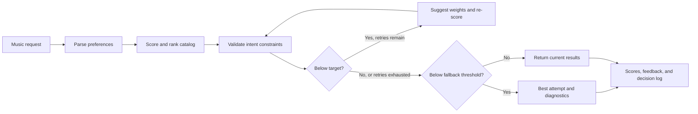

# GrooveMatch

**Content-based music recommendations with intent validation and confidence-based fallback handling.**

GrooveMatch turns a natural-language music request into a ranked playlist, then evaluates the results through a separate validation layer. The core design distinguishes **similarity scoring** from **intent compliance**: a song can rank highly overall while missing a specific request, such as low-energy music.

Built in Python, the system combines explainable feature scoring, a bounded retry pipeline, best-attempt tracking, and diagnostic output. It demonstrates a practical approach to recommendation reliability: make decisions inspectable, surface unmet constraints, and return alternatives when the target cannot be reached.

## Engineering highlights

- **Separation of concerns:** Independent scoring, validation, weight suggestion, and orchestration modules make each stage easier to inspect and test.
- **Explainable recommendations:** Each result includes a score and feature-level contributions for genre, mood, energy, acousticness, and valence.
- **Reliability pipeline:** Recommendation sets below the validation target trigger bounded re-scoring attempts; low-confidence results use the best recorded attempt with diagnostic context.
- **Traceable decisions:** Structured results include validation feedback, proposed weight changes, iteration history, and a readable decision log.
- **Local execution:** The CLI and recommendation pipeline use the Python standard library, a bundled CSV catalog, and no external API credentials.

**Adaptive scoring:** Retry attempts apply adjusted weights to every song and its score explanation. The optimizer can trade genre/mood similarity for energy compliance; retries are bounded and do not guarantee that every request can be fulfilled.

## Quick start

Run these commands from the repository root with Python 3.10 or newer:

```bash
python -m venv .venv
source .venv/bin/activate
pip install -r requirements.txt
python -m src.main
```

On Windows, use `.venv\Scripts\activate` to activate the environment.

The CLI loads the 100-song catalog and walks through six example profiles. Press Enter between profiles, then enter `y` to try your own requests. Type `quit` to exit.

Example requests:

```text
I want lofi music that is chill and relaxing, I like acoustic sounds
I want happy music but I am tired and exhausted
I want upbeat energetic pop music for my workout
```

The repository includes pandas and Streamlit in its dependency list, but the current application is a command-line program.

### Python API

```python
from src.recommender import load_songs
from src.reliability_engine import ReliabilityEngine

engine = ReliabilityEngine(load_songs("data/songs.csv"))
result = engine.process_user_request(
    "I want happy music but I am tired and exhausted",
    k=5,
)

print(engine.log_result(result))
for song, score, reasons in result.recommendations:
    print(f"{song.title} — {song.artist}: {score:.3f}")
```

`PlaylistResult` exposes recommendations, validation results, confidence, optimization steps, a decision log, and fallback metadata for callers that need more than formatted text.

## How the pipeline works



The retry node passes adjusted weights into the scorer while retaining the parsed user profile. See the [architecture notes](diagrams/system_diagram.md) for component responsibilities and control flow.

### Similarity scoring

Songs receive a weighted sum of five feature scores. The initial weights are:

| Feature | Weight | Matching rule |
| --- | ---: | --- |
| Genre | 40% | Exact genre match |
| Mood | 30% | Exact match or partial credit through predefined mood groups |
| Energy | 15% | Distance from the user's target energy |
| Acousticness | 10% | Alignment with acoustic or non-acoustic preference |
| Valence | 5% | Brightness preference inferred from the selected mood |

The scorer ranks the complete catalog and returns the top `k` songs. This deterministic baseline makes individual contributions easy to explain, at the cost of limited personalization and a strong genre/mood preference.

### Validation and fallback

The validator extracts keyword-based constraints independently of the similarity score. Energy constraints determine whether each song passes; mood and acoustic mismatches appear in feedback but do not reduce the match rate. Genre is not validated.

The field named `confidence` is the fraction of returned songs that pass these energy checks. **It is a rule-based compliance metric, not a calibrated probability of user satisfaction.** Requests without recognized energy constraints can receive 100% even when other preferences are unmet.

Default controls are configurable through `process_user_request()`:

| Parameter | Default | Behavior |
| --- | ---: | --- |
| `k` | 5 | Maximum number of recommendations |
| `min_match_rate` | 0.70 | Trigger retries below this match rate |
| `max_iterations` | 3 | Bound the number of retry attempts |
| `min_acceptable_confidence` | 0.40 | Use best-attempt fallback and diagnostics below this rate |

A result at exactly 40% does not trigger fallback. Results between 40% and 70% can be returned after retries are exhausted.

## Reproducible examples

These results were checked against the bundled 100-song catalog with the default parameters:

| Request | Match rate | Retries | Fallback |
| --- | ---: | ---: | --- |
| “I want lofi music that is chill and relaxing, I like acoustic sounds” | 80% | 0 | No |
| “I want happy music but I am tired and exhausted” | 40% | 3 | No |
| “I want upbeat energetic pop music for my workout” | 80% | 2 | No |
| “I want sleepy music” | 40% | 3 | No |

For the lofi request, the top three songs are **Night Changes** (0.549), **A Drop in the Ocean** (0.549), and **I Won't Give Up** (0.548). This catalog retains the source's `study` category rather than relabeling it as lofi, so there are no exact lofi genre matches. The 80% match rate reflects energy compliance, not genre fulfillment.

These examples demonstrate control flow and current behavior; they are not a benchmark of listener satisfaction or evidence of improvement from retrying.

## Testing

```bash
python -m pytest tests/ -v
```

The repository contains 33 test functions covering score ordering, keyword extraction, preference parsing, validation feedback, conflict detection, weight normalization, retry limits, and orchestration outputs. The tests are organized by component to make regressions easier to localize.

Regression tests verify unchanged default scores, custom-weight ranking changes and explanations, improved energy compliance on a controlled retry example, and the path that returns results without retrying.

## Project structure

```text
src/
  main.py                 CLI walkthrough and interactive requests
  recommender.py          Data models, CSV loading, and similarity scoring
  validator.py            Intent extraction and recommendation checks
  optimizer.py            Weight suggestions and iteration helpers
  reliability_engine.py   Pipeline orchestration, fallback, and diagnostics
data/songs.csv            Bundled 100-song catalog
data/song_sources.csv     Per-recording source identifiers
data/README.md            Provenance and approximate mood-label policy
tests/                    Component and pipeline tests
diagrams/system_diagram.md
model_card.md             Evaluation scope, data assumptions, and limitations
```

The [catalog notes](data/README.md) document the source, selection policy, approximate moods, and test impact. Numeric audio features are preserved from the source dataset.

## Evaluation and next steps

The [model card](model_card.md) documents the scoring rules, metric semantics, catalog constraints, and evaluation gaps. The main priorities are:

1. Evaluate retry behavior across a broader range of requests and catalog distributions.
2. Define explicit hard and soft intent constraints, then align validation and diagnostics with that policy.
3. Improve parsing for negation, ambiguous requests, and unsupported vocabulary.
4. Evaluate relevance and catalog coverage on a larger, documented dataset with human feedback.

Development included assistance from Claude. The implementation and reproducible examples are the basis for the capabilities described here.
