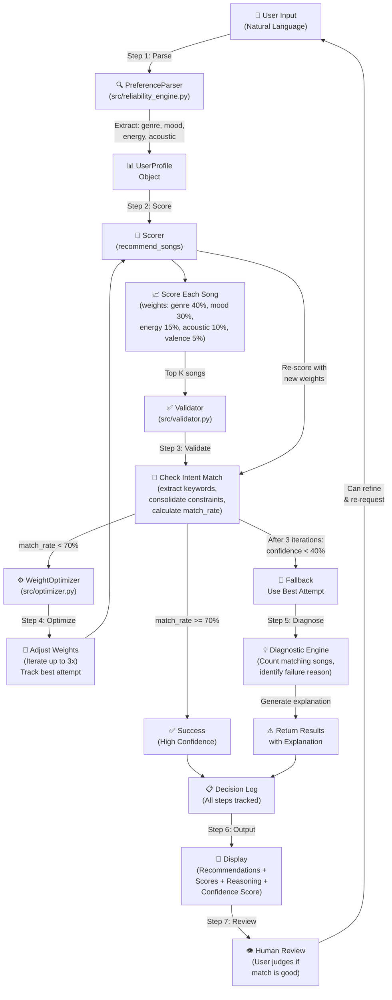
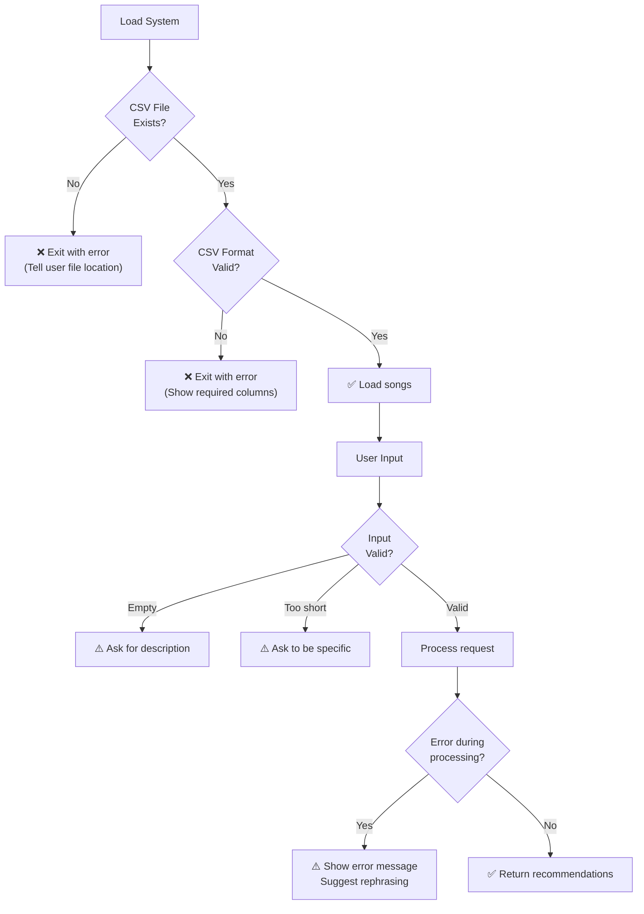

# Music Recommender System Diagram

## System Architecture



---

## Data Flow Pipeline

### Input Phase
```
User Request → PreferenceParser → UserProfile
"happy but tired"  →  genre: pop, mood: happy, energy: 0.40, acoustic: False
```

### Processing Phase
```
UserProfile + Song Catalog → Scorer → Recommendations
                                    ↓
                            Validator (Check Quality)
                                    ↓
                            Match Rate < 70%? → Optimizer
                                    ↓
                        Re-score with adjusted weights
                                    ↓
                            Still low? → Best Attempt
```

### Output Phase
```
Recommendations + Validation Results + Decision Log
                    ↓
            Display with:
            - Top 5 songs
            - Confidence score
            - Explanation of reasoning
            - If low confidence: diagnostic message
                    ↓
              Human Review
```

---

## Component Responsibilities

| Component | File | Role | Input | Output |
|-----------|------|------|-------|--------|
| **PreferenceParser** | `src/reliability_engine.py` | Parse natural language into UserProfile | User text (e.g., "happy but tired") | UserProfile(genre, mood, energy, acoustic) |
| **Scorer (recommend_songs)** | `src/recommender.py` | Score each song using weighted features | UserProfile + Song catalog | List of (Song, score, reasons) tuples |
| **Validator** | `src/validator.py` | Check if recommendations match user intent | Recommendations + user text | ValidationResult with match_rate (0.0-1.0) |
| **WeightOptimizer** | `src/optimizer.py` | Adjust weights to improve low match rates | User input + current match_rate | New normalized weights (sum to 1.0) |
| **Diagnostic Engine** | `src/reliability_engine.py` | Explain why confidence is low | Song catalog + constraints | Human-readable explanation |
| **ReliabilityEngine** | `src/reliability_engine.py` | Orchestrate entire pipeline (Steps 1-7) | User request + song catalog | PlaylistResult with recommendations, validation, decision_log, confidence |

---

## Quality Assurance & Testing Points

```mermaid
graph LR
    A["Input Validation<br/>(Empty input check)"] --> B["Parsing Check<br/>(Extract keywords)"]
    B --> C["Scoring Check<br/>(Weights sum to 1.0)"]
    C --> D["Validation Check<br/>(Match rate calculation)"]
    D --> E["Optimization Check<br/>(Weights improve match)"]
    E --> F["Fallback Check<br/>(Best attempt tracking)"]
    F --> G["Output Check<br/>(User sees reasoning)"]
    
    style A fill:#e1f5ff
    style B fill:#e1f5ff
    style C fill:#fff3e0
    style D fill:#f3e5f5
    style E fill:#f3e5f5
    style F fill:#fce4ec
    style G fill:#c8e6c9
```



### Testing Coverage
- ✅ **Validator Tests** (9 tests): Keyword extraction, constraint consolidation, match rate calculation
- ✅ **Optimizer Tests** (8 tests): Conflict detection, weight adjustment, normalization
- ✅ **ReliabilityEngine Tests** (10 tests): End-to-end request processing, decision logging
- ✅ **Integration Tests**: Full pipeline from natural language to recommendations

---

## Human-in-the-Loop Feedback

The system includes multiple points where humans check AI results:

1. **Input Level**: User provides natural language request
   - System validates input isn't empty/nonsensical
   
2. **Processing Level**: System logs every decision
   - User can see exactly what parsing happened
   - User can see which constraints were checked
   - User can see why optimization was triggered

3. **Output Level**: System shows confidence score
   - High confidence (>70%): Trust the recommendations
   - Medium confidence (40-70%): Take with caution
   - Low confidence (<40%): System explains what went wrong
   
4. **Fallback Level**: If confidence is low
   - System provides diagnostic: "No songs match all preferences"
   - Actionable suggestion: "Try relaxing one preference"
   - Shows best attempt anyway: "Here are the closest alternatives"

5. **Review Level**: User judges final recommendations
   - User can accept, reject, or refine request
   - Interactive mode allows immediate re-testing

---

## Error Handling Strategy



---

## Summary: How Reliability is Ensured

The system ensures reliable recommendations through:

1. **Validation**: Every recommendation set is checked against user intent
2. **Transparency**: All decisions are logged and explained
3. **Iteration**: If first attempt fails validation, system tries again with adjusted weights
4. **Diagnostics**: When confidence is low, system explains why
5. **Fallback**: Instead of failing silently, system returns best attempt with explanation
6. **Testing**: 27 unit tests verify each component works correctly
7. **Error Handling**: Missing files, malformed data, and bad input are caught cleanly
8. **Human Loop**: User sees confidence score and reasoning to make final judgment
