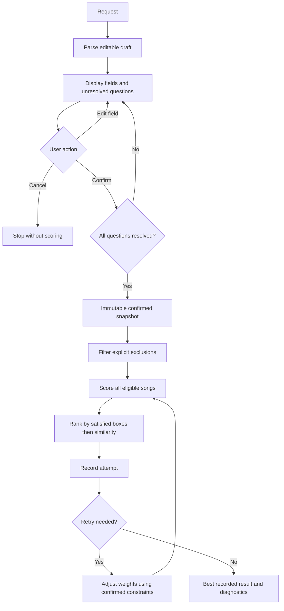

# GrooveMatch Architecture

## Request flow

## Component boundaries

| Component | Responsibility |
| --- | --- |
| `parse_preferences()` | Build a draft from shared phrase rules; preserve unresolved questions |
| `PreferenceDraft` | Validate individual edits; expose summary; refuse confirmation while unclear |
| `review_preferences()` | Numbered CLI editors, explicit confirmation, and cancellation |
| `ConfirmedPreferences` | Immutable constraint/profile snapshot used for scoring |
| `recommend_songs()` | Return similarity scores and feature contributions, using optional weights |
| `extract_keywords()` | Extract explicit genre, mood, energy, and acoustic requirements |
| `evaluate_song()` | Produce matched/missed categories and explanations; one box per requested category |
| `rank_by_preferences()` | Rank the full scored catalog by boxes satisfied, then current similarity; select top-k |
| `validate_recommendations()` | Report complete-match rate and aggregate preference coverage |
| `WeightOptimizer` | Propose normalized weights under the existing retry policy |
| `ReliabilityEngine` | Retain attempts, select the best, and provide consistent diagnostics |
| CLI | Present scores, matched/missed feedback, and threshold-triggered catalog diagnostics in both modes |

## Selection and history contracts

- Raw requests cannot score without a confirmed snapshot. Every request goes through review, including clear requests.
- Parser defaults influence similarity only; explicit recognized preferences determine validation.
- Related moods use the same existing mood groups as the scorer. Acoustic wording is a feature constraint, not an implied genre requirement.
- Explicit exclusions filter songs before scoring and are never relaxed. Every round evaluates the whole eligible catalog before top-k selection, ensuring complete matches cannot be hidden by a low similarity score.
- `attempt_history` includes round zero and every retry, with separate snapshots of recommendations, weights, validation, and quality.
- Compare rounds by complete-match count, total matched boxes, then total similarity under fixed default weights. Exact ties favor the earlier round.
- `selected_iteration` identifies the returned snapshot. `best_attempt_used` is true if an earlier round was retained or the selected result is below the diagnostic threshold.
- `confidence` remains a temporary API alias for complete-match rate; all user-facing output labels the metric “Complete-match rate.” `preference_coverage` reports partial fulfillment separately.
- With no recognized constraints, both metrics and the compatibility alias are `None`, `validation.evaluated` is false, and the single recorded attempt has `evaluated=False` and `quality=None`. After explicit acceptance of no preferences and confirmation, the system returns labeled unvalidated profile-based suggestions and skips retries and low-match-rate diagnostics.
- Default retry target: 0.70; retry limit: three; diagnostic threshold: strictly below 0.40. Best-attempt selection applies at every evaluated match rate.
- Full-catalog preference ranking already maximizes available matches. Retries only change similarity tie-breaks; they cannot create missing content.

## Verification

Tests cover complete matches below the similarity cutoff, equal-category partial ranking, related moods, independent failure of each category, repeated keywords, contradictory energy constraints, historical snapshots, earlier-round retention above the diagnostic threshold, empty results, shared diagnostic checks, confirmation gates, persistent edits, exclusion filtering, alternatives, unsupported wording, and cancellation. See the [model card](../model_card.md) for metric interpretation and remaining language limitations.

Diagnostic counts use the same song checks as validation. Messages distinguish empty catalogs, no complete matches, insufficient complete matches for the requested count, and enough complete matches. Complete, partial, and zero-preference alternatives are counted separately. Scarcity alone is never labeled a contradiction.

## Web interface

`app.py` wraps the same engine with a welcome screen, collapsible demo, and text/structured preference entry. Dropdowns and an energy range slider build an editable draft. Explicit clarification and confirmation gate scoring; results render match rates, per-song checks, similarity explanations, and retry history. Results are stored separately for demo and personal inputs and hidden when the input changes.
