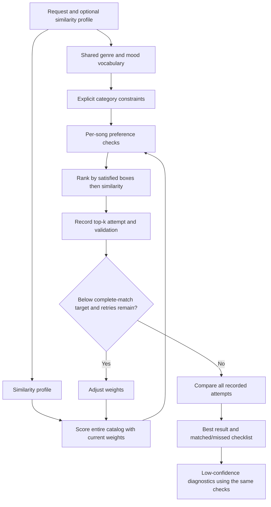

# GrooveMatch Architecture

## Request flow

## Component boundaries

| Component | Responsibility |
| --- | --- |
| `PreferenceParser` | Build the similarity profile; share genre/mood extraction with validation |
| `recommend_songs()` | Return similarity scores and feature contributions, using optional weights |
| `extract_keywords()` | Extract explicit genre, mood, energy, and acoustic requirements |
| `evaluate_song()` | Produce matched/missed categories and explanations; one box per requested category |
| `rank_by_preferences()` | Rank the full scored catalog by boxes satisfied, then current similarity; select top-k |
| `validate_recommendations()` | Report complete-match rate and aggregate preference coverage |
| `WeightOptimizer` | Propose normalized weights under the existing retry policy |
| `ReliabilityEngine` | Retain attempts, select the best, and provide consistent diagnostics |
| CLI | Present scores and matched/missed preference feedback |

## Selection and history contracts

- Parser defaults influence similarity only; explicit recognized preferences determine validation.
- Related moods use the same existing mood groups as the scorer. Acoustic wording is a feature constraint, not an implied genre requirement.
- Every round evaluates the whole catalog before top-k selection, ensuring complete matches cannot be hidden by a low similarity score.
- `attempt_history` includes round zero and every retry, with separate snapshots of recommendations, weights, validation, and quality.
- Compare rounds by complete-match count, total matched boxes, then total similarity under fixed default weights. Exact ties favor the earlier round.
- `selected_iteration` identifies the returned snapshot. `best_attempt_used` is true if an earlier round was retained or the selected result is below the diagnostic threshold.
- `confidence` remains an alias for complete-match rate. `preference_coverage` reports partial fulfillment separately.
- Default retry target: 0.70; retry limit: three; diagnostic threshold: strictly below 0.40. Best-attempt selection applies at every confidence level.
- Full-catalog preference ranking already maximizes available matches. Retries only change similarity tie-breaks; they cannot create missing content.

## Verification

Tests cover complete matches below the similarity cutoff, equal-category partial ranking, related moods, independent failure of each category, repeated keywords, contradictory energy constraints, historical snapshots, earlier-round retention above the diagnostic threshold, empty results, and shared diagnostic checks. See the [model card](../model_card.md) for metric interpretation and remaining language limitations.
