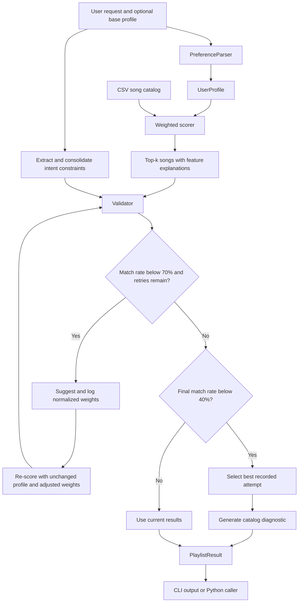

# GrooveMatch Architecture

## Request flow

The thresholds and retry limit are configurable. The default retry limit is three. The retry path applies suggested weights to ranking and feature-level score explanations; omitted weights preserve the original defaults.

## Component boundaries

| Component | Responsibility | Output |
| --- | --- | --- |
| `load_songs()` | Read CSV records into `Song` objects | Catalog |
| `PreferenceParser` | Map request keywords into genre, mood, energy, and acoustic preferences | `UserProfile` |
| `recommend_songs()` | Score every song and return the top `k` | Song, score, and explanation tuples |
| `validate_recommendations()` | Apply energy pass/fail checks and report mood/acoustic feedback | `ValidationResult` |
| `WeightOptimizer` | Propose normalized weights from request constraints | Weight dictionary |
| `ReliabilityEngine` | Coordinate parsing, scoring, validation, retries, best-attempt tracking, and diagnostics | `PlaylistResult` |
| CLI | Present demos, accept requests, and display outputs | Terminal interaction |

## Contracts and boundaries

- Similarity scores describe weighted feature alignment; validation match rate describes energy-constraint compliance.
- The `confidence` field equals validation match rate. It is not a statistical probability.
- Best-attempt tracking updates only when a retry improves match rate. Adaptive retries can improve compliance but are not guaranteed to do so.
- Fallback activates strictly below the configured confidence threshold. Exhausting retries alone does not activate it.
- Diagnostic catalog checks use stricter mood/acoustic criteria than validation, so their explanations can diverge from the reported match rate.
- The detailed demo and Python result expose diagnostic context; interactive mode presents a shorter recommendation list and confidence summary.

## Verification priorities

Existing tests exercise component outputs, weight normalization, keyword handling, and request orchestration. Regression tests verify that applied weights can change rankings and improve energy compliance on a controlled example. Further checks should cover fallback selection across varying attempts and agreement between diagnostics and validation. See the [model card](../model_card.md) for current evaluation limits.
